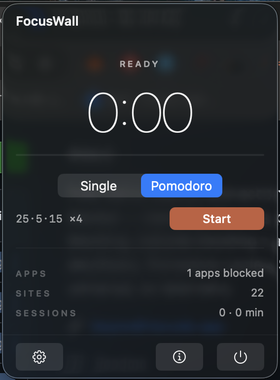

<p align="center">
  
</p>

<p align="center">
  <strong>Free native macOS distraction blocker</strong><br>
  Block distracting apps during focus sessions. Menu bar timer, Pomodoro cycles, zero subscriptions.
</p>

<p align="center">
  <a href="https://github.com/beyondthecode-bc/FocusWall/releases/latest"></a>
  <a href="https://github.com/beyondthecode-bc/FocusWall/releases/latest"></a>
  <a href="https://github.com/beyondthecode-bc/FocusWall/stargazers"></a>
  <a href="https://github.com/beyondthecode-bc/FocusWall/blob/main/LICENSE"></a>
</p>

<p align="center">
  
  
  
  
  
</p>

<p align="center">
  <a href="https://github.com/sponsors/beyondthecode-bc"></a>
  <a href="https://www.buymeacoffee.com/BEYONDTHECODE"></a>
</p>

<p align="center">
  Built with Swift and SwiftUI. No Electron, no web views, no bloat.
</p>

---

## Screenshots

<p align="center">
  
</p>

---

## Download

Download the latest version from [**Releases**](https://github.com/beyondthecode-bc/FocusWall/releases/latest). Unzip, move `FocusWall.app` to Applications, and launch.

The app includes a built-in update checker -- open **About** and click **Check Now** to see if a newer version is available.

## Features

### Menu bar timer
- Live `mm:ss` countdown in the menu bar
- Ring-progress timer view with phase label (Focus / Short Break / Long Break)
- One-click Start/Stop from the popover

### Pomodoro & single sessions
- Single mode: 1-180 min focus blocks
- Pomodoro: configurable focus / short break / long break / cycles-before-long-break
- Sessions auto-transition through break phases

### App blocking
- Pick from your installed apps (scans `/Applications`, `~/Applications`, `/System/Applications`)
- Apps that launch during a focus session are force-terminated
- Optional macOS notification each time an app is blocked
- Blocker disengages automatically during breaks and on session end

### Session history
- Every completed focus block is recorded
- Popover shows today's count + total sessions + total focused minutes
- Persisted locally in UserDefaults (capped at 200 records)

### Localized in 8 languages
- English, French, German, Spanish, Japanese, Korean, Portuguese (BR), Chinese (Simplified)
- Language picker in the About window

### Launch at login
- One-toggle registration via `SMAppService`

## Requirements

| | Requirement |
|---|---|
| **OS** | macOS 14.0 (Sonoma) or later |
| **Chip** | Any Mac (Apple Silicon or Intel) |

## Getting Started

### 1. Download and install

Download the latest `.zip` from [Releases](https://github.com/beyondthecode-bc/FocusWall/releases/latest), extract it, and move `FocusWall.app` to your Applications folder.

### 2. Launch and add apps to your blocklist

Launch the app from Applications. The hourglass icon appears in your menu bar. Click it, open **Settings**, then add the apps you want blocked during focus sessions.

### 3. Start a session

From the popover, pick **Single** or **Pomodoro** mode and click **Start**. The timer begins, and the blocker activates. Launching any blocklisted app will force-terminate it.

## Roadmap

FocusWall ships in phases:

- **Phase 1 (current)**: app blocking, Pomodoro timer, session history, settings, about, 8-language localization
- **Phase 2**: website blocking (privileged helper + `/etc/hosts` editing)
- **Phase 3**: recurring schedules, strict mode (can't cancel once started), macOS Focus mode integration
- **Phase 4**: session statistics charts, onboarding, keyboard shortcuts, polished app icon

## Translations

This repository hosts the translation files for FocusWall. You can help translate the app into your language or improve existing translations.

### How to contribute

1. Fork this repository
2. Edit an existing file in the [`languages/`](languages/) folder, or create a new one by copying `English.xml`
3. Translate the string values (the text between `<string>` tags) -- **do not** change the `key` attributes
4. Keep any `%1`, `%2`, `%@`, `%d` placeholders in place -- the app needs them
5. Submit a pull request

### Current languages

| Language | File | Status |
|---|---|---|
| English | [`English.xml`](languages/English.xml) | Complete |
| French | [`French.xml`](languages/French.xml) | Initial (community review welcome) |
| German | [`German.xml`](languages/German.xml) | Initial (community review welcome) |
| Spanish | [`Spanish.xml`](languages/Spanish.xml) | Initial (community review welcome) |
| Japanese | [`Japanese.xml`](languages/Japanese.xml) | Initial (community review welcome) |
| Korean | [`Korean.xml`](languages/Korean.xml) | Initial (community review welcome) |
| Portuguese (BR) | [`Portuguese.xml`](languages/Portuguese.xml) | Initial (community review welcome) |
| Chinese (Simplified) | [`Chinese.xml`](languages/Chinese.xml) | Initial (community review welcome) |

Want to add a new language? Copy `English.xml`, rename it to your language name, translate the values, and submit a PR.

## Bug Reports & Feature Requests

Please use [Issues](../../issues) to report bugs or request features.

## Support the Project

If FocusWall is useful to you, consider supporting development:

<p align="center">
  <a href="https://github.com/sponsors/beyondthecode-bc">
    
  </a>
  &nbsp;&nbsp;&nbsp;
  <a href="https://www.buymeacoffee.com/BEYONDTHECODE">
    
  </a>
</p>

---

## Troubleshooting

### "FocusWall" Not Opened -- Gatekeeper warning

FocusWall is not yet notarized with Apple. On first launch you may see a Gatekeeper warning.

**To fix this:**

1. Click **Done** to dismiss the dialog
2. Open **System Settings > Privacy & Security**
3. Scroll down -- you'll see a message that FocusWall was blocked
4. Click **Open Anyway**

This only needs to be done once. After that, the app will open normally.

### Administrator password required when installing an update

When you click **Install Now** in the About window, macOS will show a password prompt before replacing the app in `/Applications`. This is expected -- the app needs elevated permissions to overwrite itself.

### Some apps cannot be blocked

`forceTerminate()` may fail silently for certain signed system apps (for example some Apple Help/Services processes). Phase 2 introduces a privileged helper that will cover those edge cases.

### Build from source

```bash
brew install xcodegen
git clone https://github.com/beyondthecode-bc/FocusWall.git
cd FocusWall
xcodegen generate
open FocusWall.xcodeproj
```
